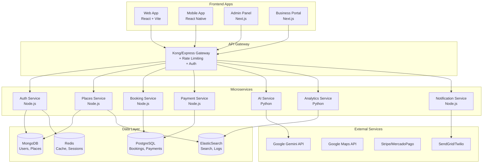

# 🔧 Plan de Implementación Técnica - Japasea 2.0

## 📋 Índice
1. [Arquitectura del Sistema](#arquitectura-del-sistema)
2. [Stack Tecnológico Detallado](#stack-tecnológico-detallado)
3. [Plan de Migración de Datos](#plan-de-migración-de-datos)
4. [Implementación por Fases](#implementación-por-fases)
5. [Seguridad y Compliance](#seguridad-y-compliance)
6. [DevOps y CI/CD](#devops-y-cicd)
7. [Optimización y Performance](#optimización-y-performance)
8. [Monitoreo y Observabilidad](#monitoreo-y-observabilidad)

---

## 🏗️ Arquitectura del Sistema

### Arquitectura de Microservicios



---

## 💻 Stack Tecnológico Detallado

### Backend Services

#### 1. Auth Service
```javascript
// Stack
- Framework: Express.js + TypeScript
- Auth: Passport.js + JWT
- Database: MongoDB
- Cache: Redis
- Validation: Joi/Yup
- Testing: Jest + Supertest

// Estructura
/auth-service
├── src/
│   ├── controllers/
│   ├── services/
│   ├── models/
│   ├── middleware/
│   ├── utils/
│   └── config/
├── tests/
├── Dockerfile
└── package.json
```

#### 2. Places Service
```javascript
// Stack
- Framework: NestJS
- ORM: Mongoose
- Search: ElasticSearch
- Cache: Redis
- Queue: Bull
- Testing: Jest

// Features
- CRUD de lugares
- Búsqueda geoespacial
- Indexación automática
- Cache inteligente
- Import/Export masivo
```

#### 3. Booking Service
```javascript
// Stack
- Framework: Fastify
- ORM: Prisma
- Database: PostgreSQL
- Events: RabbitMQ
- Calendar: Google Calendar API

// Schema
model Booking {
  id            String   @id @default(cuid())
  userId        String
  placeId       String
  date          DateTime
  time          String
  guests        Int
  status        BookingStatus
  amount        Decimal
  commission    Decimal
  notes         String?
  createdAt     DateTime @default(now())
  updatedAt     DateTime @updatedAt
}
```

#### 4. AI Service
```python
# Stack
- Framework: FastAPI
- AI: LangChain + Google Gemini
- Vector DB: Pinecone/Weaviate
- Queue: Celery + Redis
- ML: TensorFlow/PyTorch

# Features
- RAG (Retrieval Augmented Generation)
- Embeddings de lugares
- Personalización por usuario
- Análisis de sentimientos
- Predicción de preferencias
```

### Frontend Architecture

#### Web App Structure
```typescript
/client
├── src/
│   ├── features/          # Feature-based modules
│   │   ├── auth/
│   │   ├── places/
│   │   ├── booking/
│   │   ├── chat/
│   │   └── profile/
│   ├── shared/            # Shared resources
│   │   ├── components/
│   │   ├── hooks/
│   │   ├── utils/
│   │   └── styles/
│   ├── core/              # Core functionality
│   │   ├── api/
│   │   ├── store/
│   │   ├── router/
│   │   └── config/
│   └── pages/             # Route pages

// State Management
- Global: Redux Toolkit + RTK Query
- Server: React Query / SWR
- Local: Zustand
- Forms: React Hook Form + Zod
```

#### Mobile App Architecture
```typescript
// React Native + Expo
/mobile
├── src/
│   ├── screens/
│   ├── navigation/
│   ├── components/
│   ├── services/
│   ├── store/
│   └── utils/

// Key Libraries
- Navigation: React Navigation v6
- Maps: React Native Maps
- Storage: AsyncStorage + MMKV
- Animations: Reanimated 3
- UI: NativeBase / Tamagui
```

---

## 🔄 Plan de Migración de Datos

### Fase 1: Preparación
```javascript
// 1. Backup actual places.json
// 2. Crear esquemas MongoDB

const PlaceSchema = new Schema({
  key: { type: String, required: true, unique: true },
  name: { type: String, required: true },
  description: { type: String, required: true },
  type: { type: String, enum: ['hotel', 'restaurant', 'tourism', 'shopping'] },
  location: {
    type: { type: String, enum: ['Point'], default: 'Point' },
    coordinates: { type: [Number], required: true } // [lng, lat]
  },
  address: { type: String, required: true },
  contact: {
    phone: String,
    email: String,
    website: String,
    social: {
      facebook: String,
      instagram: String,
      whatsapp: String
    }
  },
  amenities: [String],
  images: [{
    url: String,
    caption: String,
    isPrimary: Boolean
  }],
  businessHours: [{
    day: Number, // 0-6
    open: String, // "08:00"
    close: String // "22:00"
  }],
  rating: {
    average: { type: Number, default: 0 },
    count: { type: Number, default: 0 }
  },
  pricing: {
    level: { type: Number, min: 1, max: 4 }, // $ - $$$$
    currency: { type: String, default: 'PYG' }
  },
  status: {
    type: String,
    enum: ['active', 'inactive', 'pending'],
    default: 'active'
  },
  metadata: {
    views: { type: Number, default: 0 },
    likes: { type: Number, default: 0 },
    verified: { type: Boolean, default: false },
    featured: { type: Boolean, default: false }
  }
}, {
  timestamps: true
});

// Índices para optimización
PlaceSchema.index({ location: '2dsphere' });
PlaceSchema.index({ type: 1, status: 1 });
PlaceSchema.index({ 'metadata.featured': -1, rating: -1 });
PlaceSchema.index({ name: 'text', description: 'text' });
```

### Fase 2: Script de Migración
```javascript
// migration/migrate-places.js
const fs = require('fs');
const mongoose = require('mongoose');
const Place = require('./models/Place');

async function migratePlaces() {
  try {
    // Conectar a MongoDB
    await mongoose.connect(process.env.MONGODB_URI);
    
    // Leer places.json
    const placesData = JSON.parse(
      fs.readFileSync('./places.json', 'utf8')
    );
    
    // Transformar y validar datos
    const transformedPlaces = placesData.map(place => ({
      key: place.key,
      name: place.key, // Extraer nombre real
      description: place.description,
      type: mapPlaceType(place.type),
      location: {
        type: 'Point',
        coordinates: [place.location.lng, place.location.lat]
      },
      address: place.address,
      contact: extractContact(place.description),
      amenities: extractAmenities(place.description),
      images: [{ 
        url: getDefaultImage(place.type),
        isPrimary: true 
      }],
      businessHours: getDefaultHours(place.type),
      pricing: { level: estimatePriceLevel(place) },
      metadata: { verified: false }
    }));
    
    // Insertar en batch
    const batchSize = 50;
    for (let i = 0; i < transformedPlaces.length; i += batchSize) {
      const batch = transformedPlaces.slice(i, i + batchSize);
      await Place.insertMany(batch, { ordered: false });
      console.log(`Migrated ${i + batch.length} places`);
    }
    
    console.log('Migration completed successfully');
  } catch (error) {
    console.error('Migration failed:', error);
  } finally {
    await mongoose.disconnect();
  }
}
```

---

## 📅 Implementación por Fases

### Sprint 1-2: Fundación (2 semanas)

#### Backend
```bash
# Semana 1
- [ ] Setup monorepo con Lerna/Nx
- [ ] Configurar Docker compose para desarrollo
- [ ] Implementar Auth Service básico
- [ ] Setup MongoDB con réplicas
- [ ] Configurar Redis

# Semana 2
- [ ] Migrar places.json a MongoDB
- [ ] Implementar Places Service CRUD
- [ ] Setup ElasticSearch + indexación
- [ ] API Gateway básico
- [ ] Tests unitarios
```

#### Frontend
```bash
# Semana 1
- [ ] Migrar a Redux Toolkit
- [ ] Implementar auth flow completo
- [ ] Crear layout sistema
- [ ] Setup React Query

# Semana 2
- [ ] Perfil de usuario
- [ ] Sistema de favoritos
- [ ] Mejoras UX/UI
- [ ] PWA configuration
```

### Sprint 3-4: Features Core (2 semanas)

#### Features
```typescript
// 1. Sistema de Búsqueda Avanzada
interface SearchFilters {
  query?: string;
  types?: PlaceType[];
  priceRange?: [number, number];
  rating?: number;
  distance?: number;
  amenities?: string[];
  isOpen?: boolean;
}

// 2. Sistema de Reseñas
interface Review {
  id: string;
  placeId: string;
  userId: string;
  rating: number;
  comment: string;
  images?: string[];
  helpful: number;
  verified: boolean;
  response?: {
    text: string;
    date: Date;
  };
}

// 3. Sistema de Reservas
interface Booking {
  id: string;
  placeId: string;
  userId: string;
  date: Date;
  time: string;
  guests: number;
  specialRequests?: string;
  status: 'pending' | 'confirmed' | 'cancelled';
  paymentStatus: 'pending' | 'paid' | 'refunded';
}
```

### Sprint 5-6: Monetización (2 semanas)

#### Implementar
1. Sistema de suscripciones con Stripe
2. Panel de negocios
3. Sistema de comisiones
4. Analytics dashboard
5. Sistema de publicidad

---

## 🔒 Seguridad y Compliance

### Seguridad API
```javascript
// 1. Rate Limiting
const rateLimiter = rateLimit({
  windowMs: 15 * 60 * 1000, // 15 minutos
  max: 100, // límite por IP
  standardHeaders: true,
  legacyHeaders: false,
  handler: (req, res) => {
    res.status(429).json({
      error: 'Too many requests',
      retryAfter: req.rateLimit.resetTime
    });
  }
});

// 2. Validación de Input
const placeSchema = Joi.object({
  name: Joi.string().min(3).max(100).required(),
  description: Joi.string().min(10).max(1000).required(),
  type: Joi.string().valid(...PLACE_TYPES).required(),
  location: Joi.object({
    lat: Joi.number().min(-90).max(90).required(),
    lng: Joi.number().min(-180).max(180).required()
  }).required()
});

// 3. Sanitización
const sanitizeHtml = require('sanitize-html');
const cleanDescription = sanitizeHtml(userInput, {
  allowedTags: ['b', 'i', 'em', 'strong', 'a'],
  allowedAttributes: {
    'a': ['href']
  }
});

// 4. CORS Configuración
const corsOptions = {
  origin: (origin, callback) => {
    const allowedOrigins = [
      'https://japasea.com',
      'https://app.japasea.com',
      'http://localhost:5173' // solo en dev
    ];
    
    if (!origin || allowedOrigins.includes(origin)) {
      callback(null, true);
    } else {
      callback(new Error('Not allowed by CORS'));
    }
  },
  credentials: true,
  maxAge: 86400 // 24 horas
};
```

### GDPR Compliance
```javascript
// 1. Derecho al olvido
async function deleteUserData(userId) {
  // Anonimizar en lugar de eliminar
  await User.updateOne(
    { _id: userId },
    { 
      email: `deleted_${userId}@japasea.com`,
      name: 'Usuario Eliminado',
      // mantener solo datos necesarios para integridad
    }
  );
  
  // Eliminar datos sensibles
  await Session.deleteMany({ userId });
  await PersonalData.deleteMany({ userId });
}

// 2. Exportación de datos
async function exportUserData(userId) {
  const userData = await User.findById(userId);
  const bookings = await Booking.find({ userId });
  const reviews = await Review.find({ userId });
  
  return {
    profile: userData,
    bookings: bookings,
    reviews: reviews,
    exportDate: new Date()
  };
}
```

---

## 🚀 DevOps y CI/CD

### Docker Configuration
```dockerfile
# Dockerfile para Node.js service
FROM node:18-alpine AS builder

WORKDIR /app
COPY package*.json ./
RUN npm ci --only=production

FROM node:18-alpine

RUN apk add --no-cache tini
ENTRYPOINT ["/sbin/tini", "--"]

WORKDIR /app
COPY --from=builder /app/node_modules ./node_modules
COPY . .

USER node
EXPOSE 3000
CMD ["node", "src/index.js"]
```

### GitHub Actions Pipeline
```yaml
name: CI/CD Pipeline

on:
  push:
    branches: [main, develop]
  pull_request:
    branches: [main]

jobs:
  test:
    runs-on: ubuntu-latest
    
    services:
      mongodb:
        image: mongo:6
        ports:
          - 27017:27017
      redis:
        image: redis:7
        ports:
          - 6379:6379
    
    steps:
    - uses: actions/checkout@v3
    
    - name: Setup Node.js
      uses: actions/setup-node@v3
      with:
        node-version: '18'
        cache: 'npm'
    
    - name: Install dependencies
      run: npm ci
    
    - name: Run tests
      run: npm test -- --coverage
      env:
        MONGODB_URI: mongodb://localhost:27017/test
        REDIS_URL: redis://localhost:6379
    
    - name: Run E2E tests
      run: npm run test:e2e
    
    - name: SonarCloud Scan
      uses: SonarSource/sonarcloud-github-action@master
      env:
        GITHUB_TOKEN: ${{ secrets.GITHUB_TOKEN }}
        SONAR_TOKEN: ${{ secrets.SONAR_TOKEN }}

  build:
    needs: test
    runs-on: ubuntu-latest
    if: github.ref == 'refs/heads/main'
    
    steps:
    - uses: actions/checkout@v3
    
    - name: Build Docker images
      run: |
        docker build -t japasea/auth-service:${{ github.sha }} ./services/auth
        docker build -t japasea/places-service:${{ github.sha }} ./services/places
    
    - name: Push to Registry
      run: |
        echo ${{ secrets.DOCKER_PASSWORD }} | docker login -u ${{ secrets.DOCKER_USERNAME }} --password-stdin
        docker push japasea/auth-service:${{ github.sha }}
        docker push japasea/places-service:${{ github.sha }}

  deploy:
    needs: build
    runs-on: ubuntu-latest
    if: github.ref == 'refs/heads/main'
    
    steps:
    - name: Deploy to Kubernetes
      uses: azure/k8s-deploy@v4
      with:
        manifests: |
          k8s/auth-service.yaml
          k8s/places-service.yaml
        images: |
          japasea/auth-service:${{ github.sha }}
          japasea/places-service:${{ github.sha }}
```

### Kubernetes Configuration
```yaml
# k8s/places-service.yaml
apiVersion: apps/v1
kind: Deployment
metadata:
  name: places-service
spec:
  replicas: 3
  selector:
    matchLabels:
      app: places-service
  template:
    metadata:
      labels:
        app: places-service
    spec:
      containers:
      - name: places-service
        image: japasea/places-service:latest
        ports:
        - containerPort: 3000
        env:
        - name: MONGODB_URI
          valueFrom:
            secretKeyRef:
              name: mongodb-secret
              key: uri
        - name: REDIS_URL
          valueFrom:
            secretKeyRef:
              name: redis-secret
              key: url
        resources:
          requests:
            memory: "256Mi"
            cpu: "250m"
          limits:
            memory: "512Mi"
            cpu: "500m"
        livenessProbe:
          httpGet:
            path: /health
            port: 3000
          initialDelaySeconds: 30
          periodSeconds: 10
        readinessProbe:
          httpGet:
            path: /ready
            port: 3000
          initialDelaySeconds: 5
          periodSeconds: 5
---
apiVersion: v1
kind: Service
metadata:
  name: places-service
spec:
  selector:
    app: places-service
  ports:
  - port: 80
    targetPort: 3000
  type: ClusterIP
```

---

## ⚡ Optimización y Performance

### Frontend Optimization
```javascript
// 1. Code Splitting
const MapComponent = lazy(() => import('./components/MapComponent'));
const ChatComponent = lazy(() => import('./components/ChatComponent'));

// 2. Image Optimization
import { Image } from '@unpic/react';

<Image
  src={place.image}
  layout="constrained"
  width={400}
  height={300}
  alt={place.name}
  loading="lazy"
  placeholder="blur"
/>

// 3. Bundle Optimization
// vite.config.ts
export default defineConfig({
  build: {
    rollupOptions: {
      output: {
        manualChunks: {
          'react-vendor': ['react', 'react-dom'],
          'mui-vendor': ['@mui/material', '@emotion/react'],
          'map-vendor': ['leaflet', 'react-leaflet'],
        }
      }
    }
  }
});

// 4. Service Worker
// sw.js
self.addEventListener('install', (event) => {
  event.waitUntil(
    caches.open('v1').then((cache) => {
      return cache.addAll([
        '/',
        '/offline.html',
        '/static/css/main.css',
        '/static/js/main.js'
      ]);
    })
  );
});
```

### Backend Optimization
```javascript
// 1. Database Query Optimization
// Usar proyecciones
const places = await Place.find(
  { type: 'restaurant', status: 'active' },
  'name description location rating' // solo campos necesarios
).lean(); // POJO en lugar de Mongoose documents

// 2. Agregación eficiente
const popularPlaces = await Place.aggregate([
  { $match: { status: 'active' } },
  { $sort: { 'metadata.views': -1 } },
  { $limit: 10 },
  { 
    $project: {
      name: 1,
      location: 1,
      rating: 1,
      viewCount: '$metadata.views'
    }
  }
]);

// 3. Caching Strategy
const cacheMiddleware = (duration = 300) => {
  return async (req, res, next) => {
    const key = `cache:${req.originalUrl}`;
    const cached = await redis.get(key);
    
    if (cached) {
      return res.json(JSON.parse(cached));
    }
    
    res.sendResponse = res.json;
    res.json = (body) => {
      redis.setex(key, duration, JSON.stringify(body));
      res.sendResponse(body);
    };
    
    next();
  };
};

// 4. Connection Pooling
const mongooseOptions = {
  maxPoolSize: 10,
  minPoolSize: 2,
  maxIdleTimeMS: 10000,
  serverSelectionTimeoutMS: 5000,
};
```

---

## 📊 Monitoreo y Observabilidad

### Stack de Monitoreo
```yaml
# docker-compose.monitoring.yml
version: '3.8'

services:
  prometheus:
    image: prom/prometheus:latest
    volumes:
      - ./prometheus.yml:/etc/prometheus/prometheus.yml
      - prometheus_data:/prometheus
    ports:
      - "9090:9090"
  
  grafana:
    image: grafana/grafana:latest
    ports:
      - "3000:3000"
    environment:
      - GF_SECURITY_ADMIN_PASSWORD=admin
    volumes:
      - grafana_data:/var/lib/grafana
  
  jaeger:
    image: jaegertracing/all-in-one:latest
    ports:
      - "16686:16686"
      - "14268:14268"
  
  elasticsearch:
    image: elasticsearch:8.11.0
    environment:
      - discovery.type=single-node
      - "ES_JAVA_OPTS=-Xms512m -Xmx512m"
    volumes:
      - es_data:/usr/share/elasticsearch/data
  
  kibana:
    image: kibana:8.11.0
    ports:
      - "5601:5601"
    depends_on:
      - elasticsearch
```

### Application Metrics
```javascript
// Prometheus metrics
const promClient = require('prom-client');
const register = new promClient.Registry();

// Métricas custom
const httpRequestDuration = new promClient.Histogram({
  name: 'http_request_duration_seconds',
  help: 'Duration of HTTP requests in seconds',
  labelNames: ['method', 'route', 'status_code']
});

const activeUsers = new promClient.Gauge({
  name: 'active_users_total',
  help: 'Total number of active users'
});

const bookingsCounter = new promClient.Counter({
  name: 'bookings_created_total',
  help: 'Total number of bookings created',
  labelNames: ['place_type', 'status']
});

// Middleware para tracking
app.use((req, res, next) => {
  const start = Date.now();
  
  res.on('finish', () => {
    const duration = (Date.now() - start) / 1000;
    httpRequestDuration
      .labels(req.method, req.route?.path || 'unknown', res.statusCode)
      .observe(duration);
  });
  
  next();
});
```

### Logging Strategy
```javascript
// Winston configuration
const winston = require('winston');
const { ElasticsearchTransport } = require('winston-elasticsearch');

const logger = winston.createLogger({
  level: process.env.LOG_LEVEL || 'info',
  format: winston.format.combine(
    winston.format.timestamp(),
    winston.format.errors({ stack: true }),
    winston.format.json()
  ),
  defaultMeta: { 
    service: 'japasea-api',
    environment: process.env.NODE_ENV 
  },
  transports: [
    new winston.transports.Console({
      format: winston.format.combine(
        winston.format.colorize(),
        winston.format.simple()
      )
    }),
    new ElasticsearchTransport({
      level: 'info',
      clientOpts: { node: process.env.ELASTICSEARCH_URL },
      index: 'japasea-logs'
    })
  ]
});

// Structured logging
logger.info('Booking created', {
  userId: user.id,
  placeId: place.id,
  amount: booking.amount,
  timestamp: new Date()
});
```

---

## 🎯 Checklist de Implementación

### Semana 1-2 ✅
- [ ] Setup del proyecto monorepo
- [ ] Configuración de Docker
- [ ] Auth Service básico
- [ ] Migración de datos a MongoDB
- [ ] Frontend auth flow

### Semana 3-4 ⏳
- [ ] Places Service completo
- [ ] Sistema de búsqueda
- [ ] Integración con ElasticSearch
- [ ] Sistema de favoritos
- [ ] PWA configuration

### Semana 5-6 🔄
- [ ] Booking Service
- [ ] Payment integration
- [ ] Sistema de reseñas
- [ ] Panel de administración
- [ ] Tests E2E

### Semana 7-8 📈
- [ ] Analytics dashboard
- [ ] Sistema de notificaciones
- [ ] Optimización de performance
- [ ] Documentación completa
- [ ] Deployment a producción

---

## 💡 Mejores Prácticas

1. **Code Quality**
   - ESLint + Prettier configurados
   - Husky para pre-commit hooks
   - Code reviews obligatorios
   - Coverage mínimo 80%

2. **Security First**
   - OWASP Top 10 compliance
   - Penetration testing trimestral
   - Dependency scanning automático
   - Secrets management con Vault

3. **Performance**
   - Core Web Vitals < 2.5s
   - API response < 200ms p95
   - Database queries < 50ms
   - CDN para assets estáticos

4. **Scalability**
   - Horizontal scaling ready
   - Stateless services
   - Event-driven architecture
   - Database sharding preparado

---

*Última actualización: Enero 2024*